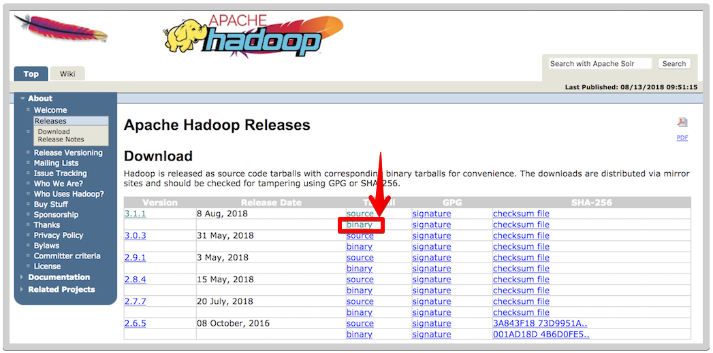
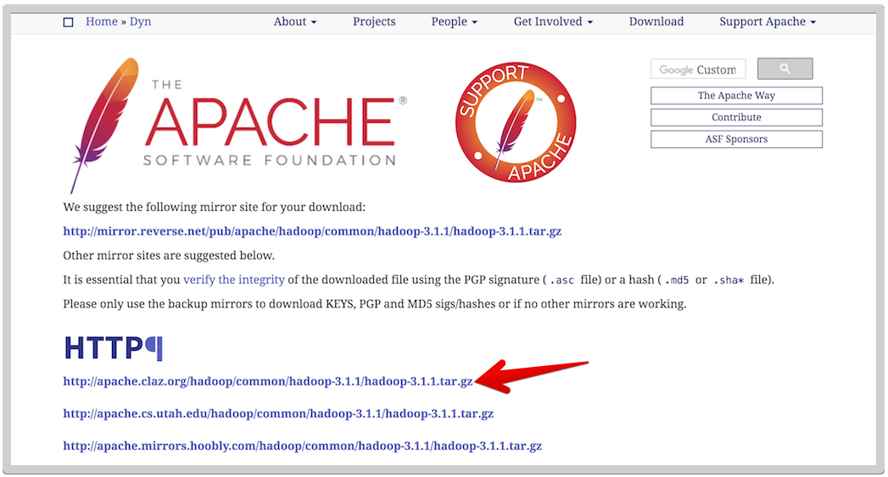
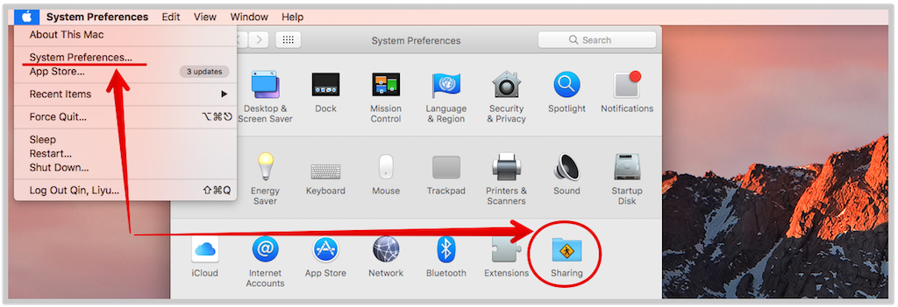
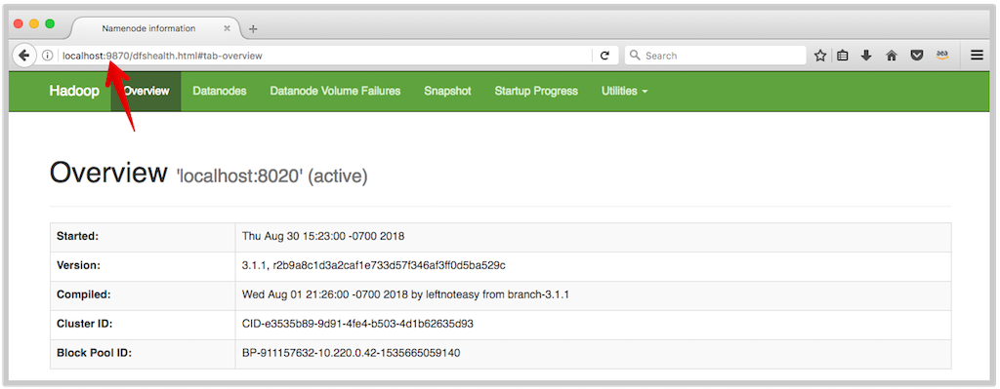
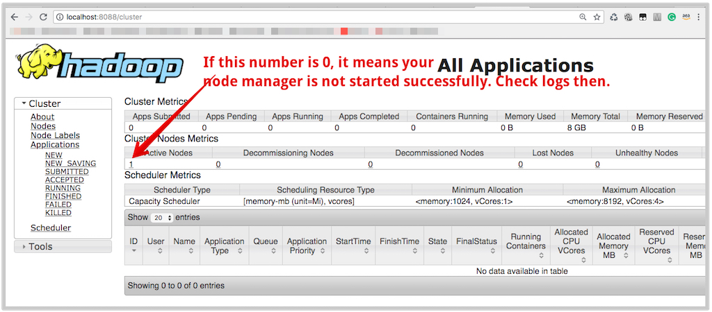
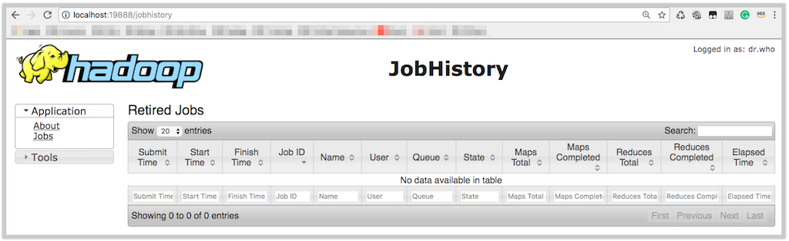

# Hadoop Installation and Configuration

1. [Installation](#1-installation)
2. [Configuration](#2-configuration)
    * [Modify XML Files](#21-modify-xml-files)
    * [Configure SSH](#22-configure-ssh)
    * [Start & Stop Daemons](#23-start--stop-daemons)

## 1. Installation

Ref: [Hadoop Installation on Mac OS X](https://isaacchanghau.github.io/post/install_hadoop_mac/)

First make sure we have java installed.
```bash
# Check Java Version
java -version
```

Note that there is still some issues for Hadoop to work with Java 9, be sure to use a Java 8 path. Refs:

* https://blog.csdn.net/ChlatZed/article/details/78858100
* https://github.com/highsource/jsonix-schema-compiler/issues/81
* https://stackoverflow.com/questions/44427653/hadoop-error-starting-resourcemanager-and-nodemanager

Go to Hadoop release page [http://hadoop.apache.org/releases.html](http://hadoop.apache.org/releases.html) and download the newest release:





```bash
# Extract hadoop gz file
cd ~/Downloads/
tar xzf hadoop-3.1.1.tar.gz

# Move to another dir
mkdir ~/Documents/Hadoop
mv hadoop-3.1.1 ~/Documents/Hadoop/hadoop-3.1.1

# Set Java & Hadoop location in .bash_profile
vi ~/.bash_profile
export JAVA_HOME=/Library/Java/JavaVirtualMachines/jdk1.8.0_144.jdk/Contents/Home/
export HADOOP_HOME=~/Documents/Hadoop/hadoop-3.1.1
export PATH=$PATH:$HADOOP_HOME/bin:$HADOOP_HOME/sbin
# Restart terminal
echo $JAVA_HOME # Make sure we have the new java location
echo $HADOOP_HOME

# Check Hadoop runs
hadoop version # Hadoop 3.1.1
```

## 2. Configuration

Each component in Hadoop is configured using an XML file. They are all in the subdirectory `~/Documents/Hadoop/hadoop-3.1.1/etc/hadoop/`. Hadoop can be run in one of three modes:
* Standalone Mode
* Pseudodistributed Mode
* Fully Distributed Mode

Only consider the configuration for the second mode here (nothing to do for 1st mode, too much to consider for 3rd mode).

### 2.1. Modify XML Files

Create a backup folder for the configuration files, in case we mess them up in the future:
```bash
cd /Users/liyuq/Documents/Hadoop/hadoop-3.1.1/etc
cp -r hadoop hadoop_backup
```

Set env variable `HADOOP_CONF_DIR`:

```bash
# Modify ~/.bash_profile
vi ~/.bash_profile
export HADOOP_CONF_DIR=~/Documents/Hadoop/hadoop-3.1.1/etc/hadoop/

# Check env variable created
source ~/.bash_profile
echo $HADOOP_CONF_DIR # /Users/.../Documents/Hadoop/hadoop-3.1.1/etc/hadoop、
```

Open the following xml files in the dir `~/Documents/Hadoop/hadoop-3.1.1/etc/hadoop/` and add some `property` tags in the `configuration` tag:

* **core-site.xml:**
    ```xml
    <configuration>
        <property>
            <name>fs.defaultFS</name>
            <value>hdfs://localhost/</value>
        </property>
    </configuration>
    ```
* **hdfs-site.xml:**
    ```xml
    <configuration>
        <property>
            <name>dfs.replication</name>
            <value>1</value>
        </property>
    </configuration>
    ```
* **mapred-site.xml:**
    ```xml
    <configuration>
        <property>
            <name>mapreduce.framework.name</name>
            <value>yarn</value>
        </property>
    </configuration>
    ```
* **yarn-site.xml:**
    ```xml
    <configuration>
        <property>
            <name>yarn.resourcemanager.hostname</name>
            <value>localhost</value>
        </property>
        <property>
            <name>yarn.nodemanager.aux-services</name>
            <value>mapreduce_shuffle</value>
        </property>
    </configuration>
    ```

### 2.2. Configure SSH

Hadoop will starts daemons on the set of hosts by SSHing to each host and starting a daemon process. So we need to make sure we can SSH to localhost without a password.

Make sure the remote login is checked in your Mac:



Generate a new SSH key with an empty passphrase to enable passwordless login:
```bash
ssh-keygen -t rsa -P '' -f ~/.ssh/id_rsa
cat ~/.ssh/id_rsa.pub >> ~/.ssh/authorized_keys
```

Then test that you can SSH into localhost with:
```bash
ssh localhost
# Use 'control + D' to exit localhost
```

If successfully, you should not have to type in a password. Then format the HDFS file system before the first use:
```bash
hdfs namenode -format
```

### 2.3. Start & Stop Daemons

Since we placed configuration files in a different dir (`~/Documents/Hadoop/hadoop-3.1.1/etc/hadoop/`), we need to start the daemons with the `--config` option.

The scripts are under `~/Documents/Hadoop/hadoop-3.1.1/sbin/`, which is already defined in our `~/.bash_profile`.


```bash
# Start services
start-dfs.sh # start HDFS service
start-yarn.sh
mr-jobhistory-daemon.sh start historyserver

# Stop services
mr-jobhistory-daemon.sh stop historyserver
stop-yarn.sh
stop-dfs.sh # stop HDFS service
```

You can check processes are running with the command `jps`:
```bash
jps
# Expected Output:
41777 NameNode
41106 NodeManager
43170 Jps
43156 JobHistoryServer
42166 ResourceManager
41880 DataNode
24046
```

Output for `start-dfs.sh` should be something like:
```
Starting namenodes on [localhost]
Starting datanodes
Starting secondary namenodes [...xxx...]
8c8590431d73.ant.amazon.com: ssh: connect to host ...xxx... port 22: Operation timed out
2018-08-30 15:23:16,711 WARN util.NativeCodeLoader: Unable to load native-hadoop library for your platform... using builtin-java classes where applicable
```

It means the local service launched successfully, then open Resource Manager in browser through the link http://localhost:50070 (**changed to port 9870 for Hadoop 3!**, ref: https://stackoverflow.com/questions/19641326/http-localhost50070-does-not-work-hadoop), you can see the following page:



You should also have access to the resource manager web ui (http://localhost:8088/) and history server web ui(http://localhost:19888/):





Here is my `~/.bash_profile` after several updates. Feel free to move hadoop-related commands to `~/.bashrc`:

```bash
export PATH=$BRAZIL_CLI_BIN:$PATH
export PATH=$PATH:/apollo/env/SDETools/bin
export PATH=$PATH:/usr/local/bin
export PATH=$PATH:/Users/liyuq/bin
export JAVA_HOME=/Library/Java/JavaVirtualMachines/jdk1.8.0_171.jdk/Contents/Home/
export HADOOP_HOME=~/Documents/Hadoop/hadoop-3.1.1
export HADOOP_CONF_DIR=$HADOOP_HOME/etc/hadoop/
export HADOOP_COMMON_LIB_NATIVE_DIR=$HADOOP_HOME/lib/native
export HADOOP_OPTS="$HADOOP_OPTS -Djava.library.path=$HADOOP_HOME/lib"
export PATH=$PATH:$HADOOP_HOME/bin:$HADOOP_HOME/sbin
```

Create a home directory for yourself:
```bash
hadoop fs -mkdir -p /usr/$USER
# Now we can make sure whether we created the folder:
hadoop fs -ls /usr/
# Output:
Found 1 items
drwxr-xr-x   - liyuq supergroup          0 2018-08-30 19:07 /usr/liyuq
```
